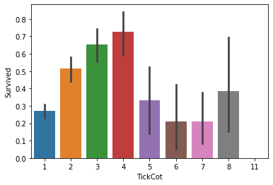
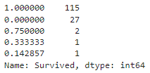
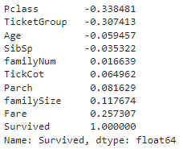

# 鐵達尼號(Titanic)生存率預測

## 壹、簡介

### 一、項目背景：
#### 泰坦尼克號的沉沒是歷史上最著名的沉船事件之一。 1912 年 4 月 15 日，鐵達尼號在與冰山相撞後沉沒。不幸的是，船上的每個人都沒有足夠的救生艇，導致 2224 名乘客和船員中有 1502 人死亡。
#### 雖然生存中涉及到一些運氣因素，但似乎有些人比其他人更有可能生存。
### 二、目的：
#### 使用機器學習創建一個模型，預測什麼樣的人更有可能在鐵達尼號沉船中生存下來。

### 三、數據採集：
#### Kaggle泰坦尼克號項目頁面：https://www.kaggle.com/c/titanic
#### 在Data中下載數據：
#### train.csv： 訓練數據集，用於模型的構建
#### test.csv ：測試數據集，無生存信息
#### gender_submission.csv ：提交的結果文件示例

### 四、 數據說明：
#### 數據內容：
| 	Index	 | 	Meaning	 |
| -------- | -------- |
| 	PassengerID	 | 	乘客編號	 |
| 	Survived	 | 	生存與否（1-生存，0-死亡）	 |
| 	Pclass	 | 	船艙等級（1/2/3等艙）	 |
| 	Name	 | 	乘客姓名	 |
| 	Sex	 | 	性別（male-男性；female-女性）	 |
| 	Age	 | 	年齡	 |
| 	Parch	 | 	父母/小孩人數	 |
| 	SibSp	 | 	兄弟姐妹/配偶人數	 |
| 	Ticket	 | 	船票編號	 |
| 	Fare	 | 	票價	 |
| 	Cabin	 | 	船艙號	 |
| 	Embarked	 | 	登船地(C = Cherbourg, Q = Queenstown, S = Southampton)	 |

#### Pclass(船艙等級)：
| 	Index	 | 	Meaning	 |
| -------- | -------- |
| 	1	 | 	頭等	 |
| 	2	 | 	二等	 |
| 	3	 | 	三等	 |

#### Embarked(登船港口)：
| 	Index	 | 	Meaning	 |
| -------- | -------- |
| 	C	 | 	C=Cherbourg(法國 瑟堡市)	 |
| 	Q	 | 	Q=Queenstown(愛爾蘭 昆士敦)	 |
| 	S	 | 	S=Southampton(英國南安普頓)	 |

-----

## 贰、Exploratory Data Analysis (EDA) & Feature Engineering
### 一、缺失值查看：
#### 利用.isnull().sum()查看缺失值，確認Survived有 418 個缺失值、Age有263個缺失值、Fare有1個缺失值、Cabin有1014 個缺失值、Embarked有2個缺失值。

#### 各資料的缺失值  - (圖1)

-----

### 二、Pclass(艙位)與Survived(生存率)的關係：
#### 使用sns.barplot()繪製Pclass(艙位)與Survived(生存率)的關係，可以看出頭等艙的生存率最高，反映出身分地位越高，能享有的服務品質會更好，遇難時會有一定優勢。

#### 繪製 Pclass(艙位)與Survived(生存率)的關係  - (圖2)

-----

### 三、Sex(性別)與Survived(生存率)的關係：
#### 使用sns.barplot()繪製Sex(性別)與Survived(生存率)的關係，可以看出女性的生存率明顯高於男性，說明歐洲的人們普遍秉持著女士優先的傳統。

#### 繪製Sex(性別)與Survived(生存率)的關係  - (圖3)

-----

### 四、SibSp(兄弟姐妹/配偶人數)與 Survived(生存率)的關係：
#### 使用sns.barplot()繪製SibSp(兄弟姐妹/配偶人數)與Survived(生存率)，可以看出人數少的生存率較高。

#### 繪製SibSp(兄弟姐妹/配偶人數)與Survived(生存率)的關係  - (圖4)

-----

### 五、Parch(父母/小孩人數)與Survived(生存率)的關係：
#### 使用sns.barplot()繪製Parch(父母/小孩人數)與Survived(生存率)，可以看出人數少的生存率較高。

#### 繪製Parch(父母/小孩人數)與Survived(生存率)的關係 -  (圖5)

-----

### 六、Embarked(登船地)缺失值處理
#### 使用.value.counts()計算Embarked(登船地)的’S’、’C’、’Q’資料數量，確認’S’最多，並將2個缺失值填入'S'。

#### Embarked(登船地)’S’、’C’、’Q’資料數量  - (圖6)

-----

### 七、Embarked(登船地)與Survived(生存率)的關係：
#### 使用sns.barplot()繪製Embarked(登船地)與Survived(生存率)，可以看出Embarked(登船地)’C’的生存率最高。

#### 繪製Embarked(登船地)與Survived(生存率)的關係  - (圖7)

-----

### 八、Fare(票價)缺失值處理：
#### 使用sns.barplot()查看Pclass(船艙)和Embarked(登船地)與Fare(票價)的關係。

#### Pclass(船艙)的頭等艙與Fare(票價)最有關係  - (圖8)

#### Embarked(登船地)’S’與Fare(票價)最有關係  - (圖9)
#### 將Pclass(船艙)為'1'且Embarked(登船地)為'S'的Fare(船票)的資料的平均值，填補到Fare(船票)的缺失值資料裡。

-----

### 九、Fare(票價)與Survived(生存率)的關係：
#### 使用sns.FacetGrid()繪製Fare(票價)與Survived(生存率)的關係。

#### 繪製Fare(票價)與Survived(生存率)的關係  - (圖10)

-----

### 十、Name(姓氏)資料處理：
#### 使用.split()將名字分割為姓氏，新增 Title 欄位並使用.map()依照姓氏的相關意思進行分類，將相同姓氏做資料合併。

#### 姓氏的數量  - (圖11)

#### 姓氏的相關意思：
| 	姓氏	 | 	意思	 |
| 	--------	 | 	--------	 |
| 	Mr.	 | 	Mister,先生	 |
| 	Miss	 | 	對未婚婦女用	 |
| 	Mlle	 | 	小姐	 |
| 	Master	 | 	傭人對未成年男少主人的稱呼	 |
| 	jonkheer	 | 	貴族	 |
| 	Mme	 | 	Madame的簡寫,夫人	 |
| 	Ms.或Mz	 | 	稱呼婚姻狀態不明的婦女	 |
| 	Mrs.	 | 	Mistress,太太/夫人	 |
| 	Don	 | 	先生（至於男士名字前的尊稱）	 |
| 	The Countless	 | 	女伯爵	 |
| 	Dona	 | 	西班牙語對女子的稱謂,相當於Lady	 |
| 	Lady	 | 	女士,指成年女子	 |
| 	Capt	 | 	Captain,隊長	 |
| 	Sir	 | 	閣下、爵士、先生	 |
| 	Col	 | 	Colonel,上校	 |
| 	Major	 | 	有少校人意思	 |
| 	Dr.	 | 	Doctor,醫生/博士	 |
| 	Rev.	 | 	Reverend,用於基督教的牧師	 |

#### 分類方式：
| 	分類	 | 	姓氏	 |
| 	--------	 | 	--------	 |
| 	Mr	 | 	Mr	 |
| 	Miss	 | 	Mlle, Miss	 |
| 	Master	 | 	Master, Jonkheer	 |
| 	Mrs	 | 	Mme, Ms, Mrs	 |
| 	Royalty	 | 	Don, the Countess, Dona, Lady,Sir	 |
| 	Officer	 | 	Capt, Col, Major, Dr, Rev	 |

#### Title欄位的姓氏數量  - (圖12)

-----

### 十一、 Title欄位與Survived(生存率)的關係
#### 使用sns.barplot繪製Title欄位的姓氏。

#### 繪製Title欄位的姓氏  - (圖13)

-----

### 十二、Parch(父母/小孩人數)和SibSp(兄弟姐妹/配偶人數)資料處理
#### 新增familyNum欄位，將Parch(父母/小孩人數)和SibSp(兄弟姐妹/配偶人數)做資料合併。
#### 使用sns.barplot繪製familyNum與Survived(生存率)的關係，可以看出家族規模為2,3,4時，生存率是最高的。

#### 繪製familyNum與Survived(生存率)的關係  - (圖14)

#### 新增 familySize 欄位，將家族規模生存率接近的資料分類：
#### 家族規模 1,7 生存率接近分為一類，以數字0表示；
#### 家族規模 2,3,4 生存率接近分為一類，以數字1表示；
#### 家族規模 5,6 生存率接近分為一類，以數字2表示。

#### 使用sns.barplot繪製 familySize 與 Survived(生存率)的關係，可以看出家族規模為2,3,4時，生存率是最高的。

#### 繪製 familySize 與 Survived(生存率)的關係 - (圖15)

-----

### 十三、T icket(票號)資料處理
### 宣告名為 TicketCountDict 的字典變數，將 Ticket(票號) 資料分類且計算數量，給值到 TicketCountDict 的字典變數裡，並查看 TicketCountDict 資料

#### 繪製TicketCountDict 資料 – (圖16)

#### 在 full 資料集新增欄位 TickCot,使用map()將 TicketCountDict轉換陣列內的元素，給值到新欄位 TickCot，並查看 TickCot 資料。

#### 繪製TickCot資料 – (圖17)

#### 繪製 TickCot 與 Survived(生存率)的關係，可以看出存活率2,3,4的資料接近，1,5,8的資料接近，6,7,11的資料接近。

#### 繪製TickCot 與 Survived(生存率)的關係 – (圖18)

#### 定義 function 名稱為 TicketCountGroup，將存活率接近的 TickCot 資料做分類，且數值化表示。
#### 新增 TicketGroup 欄位，使用map()將TickCot轉換陣列內的元素，給值到新欄位TicketGroup。

#### 查看TicketGroup欄位 – (圖19)

-----

### 十四、TicketGroup欄位與Survived(生存率)的關係
#### 使用sns.barplot繪製TicketGroup與Survived(生存率)的關係，可以看出分類'0'的生存率最高。

#### 繪製TicketGroup與Survived(生存率)的關係  - (圖20)

-----

### 十五、 Age(年齡)缺失值處理
#### 可以看出0到10歲和15到40歲這兩個年齡層Survived(生存率)較大，遇難時優先保護小孩子是普遍的價值觀；一般出遊的人年紀落在15到40歲的人數會相對較多，所以Survived(生存率)有集中於15到40歲的趨勢。

#### 繪製Age(年齡)與Survived(生存率)的關係 - (圖21)

-----

#### 將Age,Pclass,Title,TickCot,familyNum,Parch,SibSp 資料給值到變數 AgePre；使用get_dummies()，對變數AgePre進行類別變量轉換為標籤變量。
#### 新增變數AgeCorrDf設為DataFrame的二維資料結構；使用corr()計算AgePre的相關係數求取並給值到變數AgeCorrDf，查看 Age欄位，可以看出Parch、SibSp、Pclass的相關係數較高(取值接近-1，表示反相關，類似反比例函數，取值接近1，表正相關

#### 查看AgeCorrDf的 Age欄位 - (圖22)

-----

#### 分別對Parch、SibSp、Pclass進行get_dummies()，然後給值到變數ParAge、SibAge、PclAge；將資料AgePre、ParAge、SibAge、PclAge 作合併到AgePre。

#### 查看AgePre的欄位 - (圖23)

#### 拆分AgePre資料的Age欄位，分為Features和Label，Features將Age欄位刪除，Label只取Age欄位。
#### 利用RF(RandomForestRegressor)建立模型，使用fit()進行資料預處理，使用score()進行評分；取出AgePre資料age為null的資料，使用drop()將age欄位刪除，製作生成Prediction使用的Features。
#### 取出AgePre資料age為null的資料，使用drop()將age欄位刪除，製作生成Prediction使用的Feature，使用predict()預測Age，將預測 Age 填入到缺失值裡。

#### 查看AgePre的欄位 - (圖24)

-----

## 十六、Survived資料處理
#### 使用map()、lambda、split()、strip()對Name欄位的資料進行姓氏處理，新增Surname欄位，將處理好的資料給欄位Surname。
#### 創建MaleDf變數，資料為家庭成員大於等於2且年齡大於12歲的男性。
#### 創建FemChildDf變數，資料為家庭成員大於等於2而且為女性或年齡小於等於12歲的人。

#### 使用groupby()，用MaleDf的Survived資料，對MaleDf的Surname資料進行分類並計算平均值，並存入MSurNamDf變數。

#### 查看MSurNamDf - (圖25)

#### 取出MSurNamDf生存率為1的姓氏，並存入MSurNamDict變數。

#### 查看MSurNamDict - (圖26)

#### 使用groupby()，用FemChildDf的Survived資料，對FemChildDf的Surname資料進行分類並計算平均值，並存入FCSurNamDf變數。

#### 查看FCSurNamDf - (圖27)

#### 取出FCSurNamDf生存率為0的姓氏，並存入FCSurNamDict變數。

#### 查看FCSurNamDict - (圖28)

#### 將資料集中Survived為空白值，且資料集中Surname為MSurNamDict，且性別為男性的進行填補和修正，性别改為女、Age改為5。
#### 將資料集中Survived為空白值，且資料集中Surname為FCSurNamDict，且性別為女性及兒童的資料進行填補和修正，性别改為男、Age改為60。

-----

## 叁、Select Feature
### 一、資料選擇：
#### 新建變數fullSel，將full資料的Cabin,Name,Ticket,PassengerId,
#### Surname,SurnameNum欄位刪除，並將值給變數fullSel。
#### 新建變數corrDf，進行fullSel的相關係數求取，並將值給變數corrDf。
#### 查看Survived欄位的相關性，類似反比例函數，取值接近-1，表示反相關，取值接近1，表正相關。

#### 查看Survived欄位的相關性 - (圖29)

#### 使用HeatMap()繪製Survived與其他Feature間相關性大小。
#### 可以看出SibSp,Parch,familyNum,TickCot欄位相關性太高，所以刪除，並免過度擬合。

#### 繪製Survived與其他Feature間相關性大小 - (圖30)

### 二、建立訓練集、測試集：
#### 使用one-hot Encoding，將類別變量轉換為標籤變量。
#### 分別對fullSel、Pclass、TicketGroup、familySize進行get_dummies()，然後給值到變數fullSel、PclassDf、TickGroupDf、familySizeDf。
#### 將資料fullSel、PclassDf、TickGroupDf、familySizeDf作合併到fullSel。
#### 將fullSel的Survived為非空白值的資料取出，並給值到變數experData。
#### 移除experData的Survived資料，當作訓練集的Features，並給值到變數experData_X。

#### 查看experData_X的欄位 - (圖31)

#### 使用experData的Survived資料，當作訓練集的Label，並給值到變數experData_y。

#### 查看experData_y - (圖32)

#### 將fullSel的Survived是空白值的資料取出，並給值到變數perData。
#### 移除preData的Survived資料，當作測試資料Features，並給值到變數perData_X。

#### 查看perData_X的欄位 - (圖33)